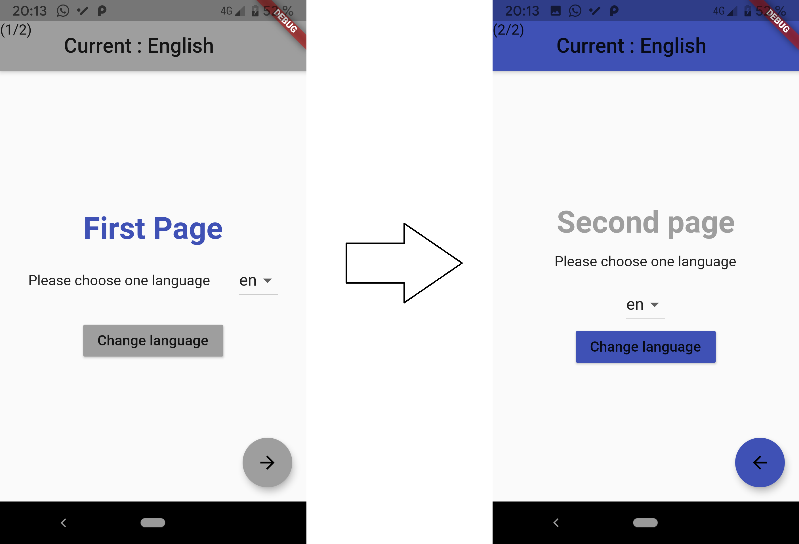
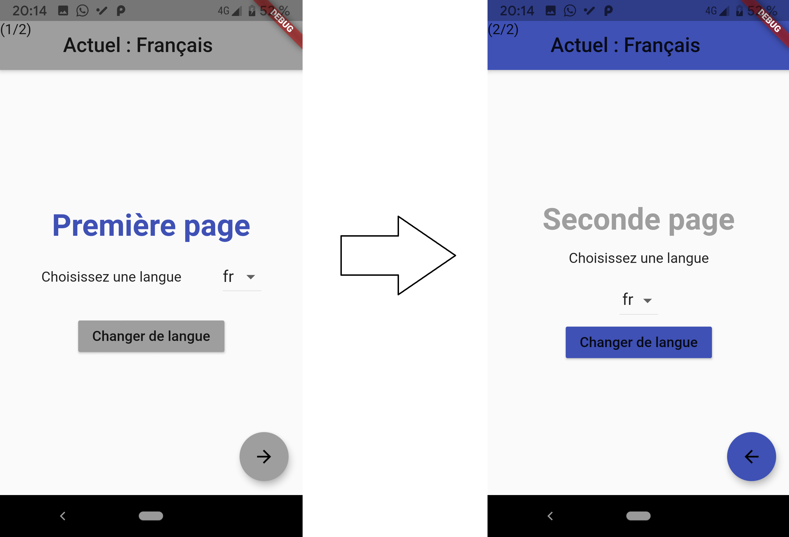

# Manage Flutter Internationalization (with JSON)

Flutter project example to manage internationalization (different languages) using JSON file

## Screenshots examples





## How to

* Copy the directory `lib/internalialization/` in your `lib/` directory
  
* Create all translation files (with the same keys) in the i18n folder.  
  
  The name of each file should be the same as the one contained in the `supportedLanguages` variable (List) in the `lib/ internationalization/internationalization.dart` file

* Add these lines in the `pubspec.yaml` file :  
  
```dart
dev_dependencies:
  flutter_test:
    sdk: flutter
  flutter_localizations: # ADD THIS
    sdk: flutter # ADD THIS

flutter:
    assets: # ADD THIS
        - lib/internationalization/i18n/ # ADD THIS
```

* After that you can use this :

```dart
// ADD THIS IMPORT 
import 'package:flutter_localizations/flutter_localizations.dart';

// ADD THIS IN YOUR MAIN CLASS
import 'internationalization/init_i18n.dart';
Map<String, Map<String, String>> localizedValues = await initializeI18n();

// ADD THIS IN YOUR MATERIAL APP
localizationsDelegates: [
    InternationalizationDelegate(this.localizedValues),
    GlobalMaterialLocalizations.delegate,
    GlobalWidgetsLocalizations.delegate,
],
supportedLocales: supportedLanguages.map(
    (language) => Locale(language, '')
),
```

* **OR** in another way (using FutureBuilder):

```dart
// ADD THIS IMPORT
import 'package:flutter_localizations/flutter_localizations.dart';
import 'internationalization/Internationalization.dart';
import 'internationalization/init_i18n.dart';

class App extends StatelessWidget {
  @override
  Widget build(BuildContext context) {
    return FutureBuilder<Map<String, Map<String, String>>>(
        future: initializeI18n(), // Retrieves JSON language files
        builder: (BuildContext context, AsyncSnapshot snapshot) {
          // We check if we have data in snapshot (if snapshot is empty we cannot construct the MaterialApp)
          if (snapshot.hasData) {
            return MaterialApp(
              /// For internationalization
              localizationsDelegates: [
                // here snapshot.data contain the localized values needed for `[Internationalization()]`
                InternationalizationDelegate(snapshot.data),
                GlobalMaterialLocalizations.delegate,
                GlobalWidgetsLocalizations.delegate,
              ],
              supportedLocales: supportedLanguages.map((language) => Locale(language, '')),
              home: FirstPage(),
            );
          }
          return CircularProgressIndicator();
        });
  }
}
```

* If you are in another file do not forget the import (Change according to the path):

```dart
import 'internationalization/Internationalization.dart';
```

* USE JSON FILE (Internationalization)

  We assume that our JSON contains the key "hello" like this :

  ```json
  {
    "_comment": "file en.json",
    "hello": "Hello"
  }
  
  {
    "_comment": "file fr.json",
    "hello": "Hello"
  }

  {
    "_comment": "file it.json",
    "hello": "Ciao"
  }
  ```
  
  In your dart code, use like this :

```dart
// In a string
String helloText = Internationalization.of(context).greetTo('hello');
// or in the Widget
Text(Internationalization.of(context).greetTo('hello'),),
```

## Run / Test

When you are on lib/main.dart, there are two functions :

* main() // we use a FutureBuilder
* mainn()

You can replace mainn() for main() and test the other architecture  
I recommand the `FutureBuilder()` architecture

## Author

* [Avi Mimoun](https://www.github.com/av1m)

## Repository available on Github

* [Link of this repository](https://github.com/av1m/JsonInternationalization)
